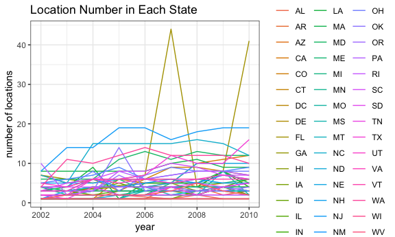
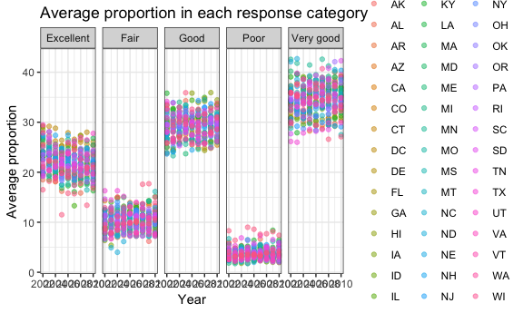
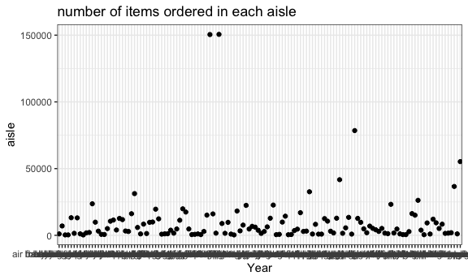
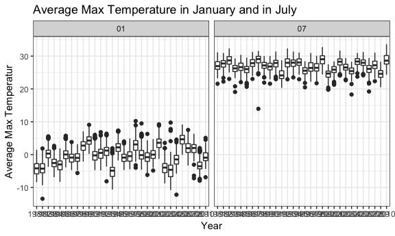
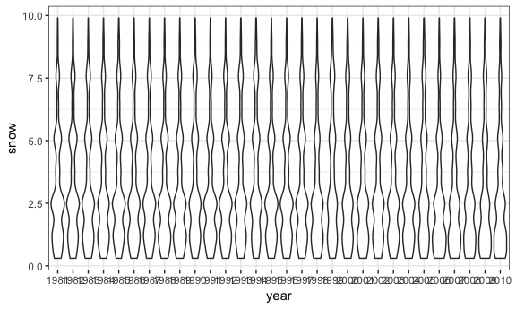

p8105\_hw3\_rm3609
================
Runqi Ma
2018/10/14

``` r
library(tidyverse)
```

    ## ─ Attaching packages ──────────────────────────────── tidyverse 1.2.1 ─

    ## ✔ ggplot2 3.0.0     ✔ purrr   0.2.5
    ## ✔ tibble  1.4.2     ✔ dplyr   0.7.6
    ## ✔ tidyr   0.8.1     ✔ stringr 1.3.1
    ## ✔ readr   1.1.1     ✔ forcats 0.3.0

    ## ─ Conflicts ───────────────────────────────── tidyverse_conflicts() ─
    ## ✖ dplyr::filter() masks stats::filter()
    ## ✖ dplyr::lag()    masks stats::lag()

``` r
library(patchwork)
knitr::opts_chunk$set(
  fig.width = 6,
  fig.asp = .6,
  out.width = "90%"
)

theme_set(theme_bw() + theme(legend.position = "bottom"))
```

Problem 1
=========

### First, do some data cleaning:

format the data to use appropriate variable names; focus on the “Overall Health” topic include only responses from “Excellent” to “Poor” organize responses as a factor taking levels ordered from “Excellent” to “Poor”

``` r
devtools::install_github("p8105/p8105.datasets")
```

    ## Skipping install of 'p8105.datasets' from a github remote, the SHA1 (21f5ad1c) has not changed since last install.
    ##   Use `force = TRUE` to force installation

``` r
library(p8105.datasets)
data(brfss_smart2010)

brfss_smart2010 = janitor::clean_names(brfss_smart2010) %>% 
  rename(resp_id = respid, state = locationabbr, location = locationdesc) %>% 
  filter(topic == "Overall Health", 
         response %in% c("Excellent","Very good","Good","Fair","Poor"))


mutate(brfss_smart2010,response = as.factor(response)) %>% 
  mutate(response = forcats::fct_relevel(response, c("Excellent", "Very good", "Good", "Fair", "Poor")))
```

    ## # A tibble: 10,625 x 23
    ##     year state location class topic question response sample_size
    ##    <int> <chr> <chr>    <chr> <chr> <chr>    <fct>          <int>
    ##  1  2010 AL    AL - Je… Heal… Over… How is … Excelle…          94
    ##  2  2010 AL    AL - Je… Heal… Over… How is … Very go…         148
    ##  3  2010 AL    AL - Je… Heal… Over… How is … Good             208
    ##  4  2010 AL    AL - Je… Heal… Over… How is … Fair             107
    ##  5  2010 AL    AL - Je… Heal… Over… How is … Poor              45
    ##  6  2010 AL    AL - Mo… Heal… Over… How is … Excelle…          91
    ##  7  2010 AL    AL - Mo… Heal… Over… How is … Very go…         177
    ##  8  2010 AL    AL - Mo… Heal… Over… How is … Good             224
    ##  9  2010 AL    AL - Mo… Heal… Over… How is … Fair             120
    ## 10  2010 AL    AL - Mo… Heal… Over… How is … Poor              66
    ## # ... with 10,615 more rows, and 15 more variables: data_value <dbl>,
    ## #   confidence_limit_low <dbl>, confidence_limit_high <dbl>,
    ## #   display_order <int>, data_value_unit <chr>, data_value_type <chr>,
    ## #   data_value_footnote_symbol <chr>, data_value_footnote <chr>,
    ## #   data_source <chr>, class_id <chr>, topic_id <chr>, location_id <chr>,
    ## #   question_id <chr>, resp_id <chr>, geo_location <chr>

### In 2002, which states were observed at 7 locations?

``` r
brfss_smart2010 %>% 
  filter(year == 2002) %>% 
  group_by(state) %>% 
  summarize(n = n_distinct(location)) %>% 
  filter(n == 7)
```

    ## # A tibble: 3 x 2
    ##   state     n
    ##   <chr> <int>
    ## 1 CT        7
    ## 2 FL        7
    ## 3 NC        7

CT, FL, NC were observed at 7 location in 2002.

### Make a “spaghetti plot” that shows the number of locations in each state from 2002 to 2010.

``` r
brfss_smart2010 %>% 
  filter(year %in% c(2002:2010)) %>% 
  group_by(state, year) %>% 
  summarize(n = n_distinct(location)) %>% 
  ggplot(aes(x = year, y = n, color = state), alpha = .5) +
  geom_line() +
   labs(
    title = "Location Number in Each State",
    x = "year",
    y = "number of locations"
  ) + 
  theme_bw()
```



The “spaghetti plot” shows the number of locations in each state from 2002 to 2010. It is hard to distinguish every state in this plot beacause there are too many states. But you can see most states have location number under 10, and one state has a peak in 2007.

### Make a table showing, for the years 2002, 2006, and 2010, the mean and standard deviation of the proportion of “Excellent” responses across locations in NY State.

``` r
brfss_smart2010 %>% 
  filter(year %in% c(2002, 2006, 2010), state == "NY", response == "Excellent" ) %>%
  group_by(year) %>% 
  summarize(mean = mean(data_value),
            sd = sd(data_value)) %>% 
  knitr::kable()
```

|  year|      mean|        sd|
|-----:|---------:|---------:|
|  2002|  24.04000|  4.486424|
|  2006|  22.53333|  4.000833|
|  2010|  22.70000|  3.567212|

The table shows the mean and standard deviation of the proportion of “Excellent” responses across locations in NY State, for the years 2002, 2006, and 2010. It seems that there are not much difference between three years.

### For each year and state, compute the average proportion in each response category (taking the average across locations in a state). Make a five-panel plot that shows, for each response category separately, the distribution of these state-level averages over time.

``` r
brfss_smart2010 %>% 
  group_by(state, year, response) %>% 
  summarize(prop_mean = mean(data_value)) %>% 
  ggplot(aes(x = year, y = prop_mean, color = state)) +
  geom_point(alpha = .5) +
  facet_grid(~response) +
   labs(
    title = "Average proportion in each response category",
    x = "Year",
    y = "Average proportion"
  ) + 
  theme_bw()
```

    ## Warning: Removed 21 rows containing missing values (geom_point).



The average proportion in each response category across different states and years is general similar. "Poor" has the lowest proportion while "Very Good" has the highest.

Problem 2
=========

### Write a short description of the dataset, noting the size and structure of the data, describing some key variables, and giving illstrative examples of observations.

``` r
insta = instacart %>% janitor::clean_names()
skimr::skim(insta)
```

    ## Skim summary statistics
    ##  n obs: 1384617 
    ##  n variables: 15 
    ## 
    ## ─ Variable type:character ───────────────────────────────────────
    ##      variable missing complete       n min max empty n_unique
    ##         aisle       0  1384617 1384617   3  29     0      134
    ##    department       0  1384617 1384617   4  15     0       21
    ##      eval_set       0  1384617 1384617   5   5     0        1
    ##  product_name       0  1384617 1384617   3 159     0    39123
    ## 
    ## ─ Variable type:integer ────────────────────────────────────────
    ##                variable missing complete       n       mean        sd p0
    ##       add_to_cart_order       0  1384617 1384617       8.76      7.42  1
    ##                aisle_id       0  1384617 1384617      71.3      38.1   1
    ##  days_since_prior_order       0  1384617 1384617      17.07     10.43  0
    ##           department_id       0  1384617 1384617       9.84      6.29  1
    ##               order_dow       0  1384617 1384617       2.7       2.17  0
    ##       order_hour_of_day       0  1384617 1384617      13.58      4.24  0
    ##                order_id       0  1384617 1384617 1706297.62 989732.65  1
    ##            order_number       0  1384617 1384617      17.09     16.61  4
    ##              product_id       0  1384617 1384617   25556.24  14121.27  1
    ##               reordered       0  1384617 1384617       0.6       0.49  0
    ##                 user_id       0  1384617 1384617   1e+05     59487.15  1
    ##     p25     p50     p75    p100             hist
    ##       3       7      12      80 ▇▃▁▁▁▁▁▁
    ##      31      83     107     134 ▃▇▃▃▇▅▅▆
    ##       7      15      30      30 ▂▅▃▃▁▂▁▇
    ##       4       8      16      21 ▃▇▂▁▂▆▁▃
    ##       1       3       5       6 ▇▅▃▃▁▃▅▅
    ##      10      14      17      23 ▁▁▃▇▇▇▅▂
    ##  843370 1701880 2568023 3421070 ▇▇▇▇▇▇▇▇
    ##       6      11      21     100 ▇▂▁▁▁▁▁▁
    ##   13380   25298   37940   49688 ▆▆▇▇▇▆▇▇
    ##       0       1       1       1 ▆▁▁▁▁▁▁▇
    ##   51732   1e+05  154959  206209 ▇▇▇▇▇▇▇▇

The instacart dataset has 1384617 observations and 15 variables. It contains online grocery orders information, such as the time, order id, user id, pruduct information (alsie, pruduct name, apartment) and so on.

### How many aisles are there, and which aisles are the most items ordered from?

``` r
insta %>% 
  count(aisle) %>% 
  arrange(desc(n))
```

    ## # A tibble: 134 x 2
    ##    aisle                              n
    ##    <chr>                          <int>
    ##  1 fresh vegetables              150609
    ##  2 fresh fruits                  150473
    ##  3 packaged vegetables fruits     78493
    ##  4 yogurt                         55240
    ##  5 packaged cheese                41699
    ##  6 water seltzer sparkling water  36617
    ##  7 milk                           32644
    ##  8 chips pretzels                 31269
    ##  9 soy lactosefree                26240
    ## 10 bread                          23635
    ## # ... with 124 more rows

There are 134 aisles. Fresh vegetables are the most items.

### Make a plot that shows the number of items ordered in each aisle. Order aisles sensibly, and organize your plot so others can read it.

``` r
insta %>% 
  group_by(aisle) %>% 
  summarize(n = n()) %>% 
  ggplot(aes(x = aisle, y = n)) +
  geom_point() +
  labs(
    title = "number of items ordered in each aisle",
    x = "Year",
    y = "aisle"
  ) + 
  theme_bw()
```



### Make a table showing the most popular item in each of the aisles “baking ingredients”, “dog food care”, and “packaged vegetables fruits”.

``` r
insta %>%
  filter(aisle %in% c("baking ingredients", "dog food care", "packaged vegetables fruits")) %>% 
  group_by(aisle) %>%
  count(product_name) %>%
  filter(n == max(n)) %>% 
  knitr::kable()
```

| aisle                      | product\_name                                 |     n|
|:---------------------------|:----------------------------------------------|-----:|
| baking ingredients         | Light Brown Sugar                             |   499|
| dog food care              | Snack Sticks Chicken & Rice Recipe Dog Treats |    30|
| packaged vegetables fruits | Organic Baby Spinach                          |  9784|

The most popular item in baking ingredients is Light Brown Sugar, in dog food care is Snack Sticks Chicken & Rice Recipe Dog Treats, in packaged vegetables fruits is Organic Baby Spinach.

### Make a table showing the mean hour of the day at which Pink Lady Apples and Coffee Ice Cream are ordered on each day of the week; format this table for human readers (i.e. produce a 2 x 7 table).

``` r
insta %>%
  filter(product_name %in% c("Pink Lady Apples", "Coffee Ice Cream")) %>%
  mutate(order_dow = 
           factor(order_dow, labels = c("Sun", "Mon", "Tue", "Wed", "Thu", "Fri", "Sat"))) %>% 
  group_by(product_name, order_dow) %>%
  summarize(mean_hour = mean(order_hour_of_day)) %>% 
  spread(key = order_dow, value = mean_hour) %>% 
  knitr::kable()
```

| product\_name       |        Sun|         Mon|          Tue|          Wed|          Thu|          Fri|                                                                          Sat|
|:--------------------|----------:|-----------:|------------:|------------:|------------:|------------:|----------------------------------------------------------------------------:|
| Coffee Ice Cream    |   13.77419|    14.31579|     15.38095|     15.31818|     15.21739|     12.26316|                                                                     13.83333|
| Pink Lady Apples    |   13.44118|    11.36000|     11.70213|     14.25000|     11.55172|     12.78431|                                                                     11.93750|
| The table shows the |  mean hour|  of the day|  at which Pi|  nk Lady App|  les and Cof|  fee Ice Cre|  am are ordered on each day of the week. Day 0 in dataset represents Sunday.|

Problem 3
=========

Write a short description of the dataset, noting the size and structure of the data, describing some key variables, and indicating the extent to which missing data is an issue.

``` r
skimr::skim(ny_noaa)
```

    ## Skim summary statistics
    ##  n obs: 2595176 
    ##  n variables: 7 
    ## 
    ## ─ Variable type:character ───────────────────────────────────────
    ##  variable missing complete       n min max empty n_unique
    ##        id       0  2595176 2595176  11  11     0      747
    ##      tmax 1134358  1460818 2595176   1   4     0      532
    ##      tmin 1134420  1460756 2595176   1   4     0      548
    ## 
    ## ─ Variable type:Date ─────────────────────────────────────────
    ##  variable missing complete       n        min        max     median
    ##      date       0  2595176 2595176 1981-01-01 2010-12-31 1997-01-21
    ##  n_unique
    ##     10957
    ## 
    ## ─ Variable type:integer ────────────────────────────────────────
    ##  variable missing complete       n  mean     sd  p0 p25 p50 p75  p100
    ##      prcp  145838  2449338 2595176 29.82  78.18   0   0   0  23 22860
    ##      snow  381221  2213955 2595176  4.99  27.22 -13   0   0   0 10160
    ##      snwd  591786  2003390 2595176 37.31 113.54   0   0   0   0  9195
    ##              hist
    ##  ▇▁▁▁▁▁▁▁
    ##  ▇▁▁▁▁▁▁▁
    ##  ▇▁▁▁▁▁▁▁

The ny\_noaa dataset has 2595176 observations and 7 variables. It contains the weather data for NY across years. There are a lot of missing value in max and min temperature, precipitation, snowfall and snow depth. Precipitation, snowfall and snow depth data are highly skewed.

### Do some data cleaning. Create separate variables for year, month, and day. Ensure observations for temperature, precipitation, and snowfall are given in reasonable units. For snowfall, what are the most commonly observed values? Why?

``` r
noaa = ny_noaa %>% 
  separate(date, into = c("year", "month", "day"), sep = "-") %>% 
  mutate(
    tmax = as.numeric(tmax)/10, 
    tmin = as.numeric(tmin)/10, 
    prcp = as.numeric(prcp)/10, 
    snow = as.numeric(snow)/10,
    snwd = as.numeric(snwd)/10)
  
noaa %>% 
  count(snow) %>% 
  arrange(desc(n))
```

    ## # A tibble: 282 x 2
    ##     snow       n
    ##    <dbl>   <int>
    ##  1   0   2008508
    ##  2  NA    381221
    ##  3   2.5   31022
    ##  4   1.3   23095
    ##  5   5.1   18274
    ##  6   7.6   10173
    ##  7   0.8    9962
    ##  8   0.5    9748
    ##  9   3.8    9197
    ## 10   0.3    8790
    ## # ... with 272 more rows

### Make a two-panel plot showing the average max temperature in January and in July in each station across years. Is there any observable / interpretable structure? Any outliers?

``` r
noaa %>% 
  filter(month %in% c("01", "07") & is.na(tmax) == FALSE) %>% 
  group_by(month, id, year) %>% 
  summarize(aver_maxt = mean(tmax,na.rm = TRUE)) %>% 
  ggplot(aes(x = year, y = aver_maxt), color = id) +
  geom_boxplot() +
  facet_grid(~month) +
   labs(
    title = "Average Max Temperature in January and in July",
    x = "Year",
    y = "Average Max Temperatur"
  ) + 
  theme_bw()
```



For Janurary, there are outliers both above and under the boxes, means there are abnormal high and low temperature in Janurary. However in July, most of the outliers are above the boxes.

### Make a two-panel plot showing (i) tmax vs tmin for the full dataset (note that a scatterplot may not be the best option) (ii) make a plot showing the distribution of snowfall values greater than 0 and less than 100 separately by year.

``` r
dist_snow = 
  noaa %>% 
  filter(snow > 0 & snow < 10) %>% 
  ggplot(aes(x = year, y = snow)) +
  geom_violin()
 dist_snow 
```


